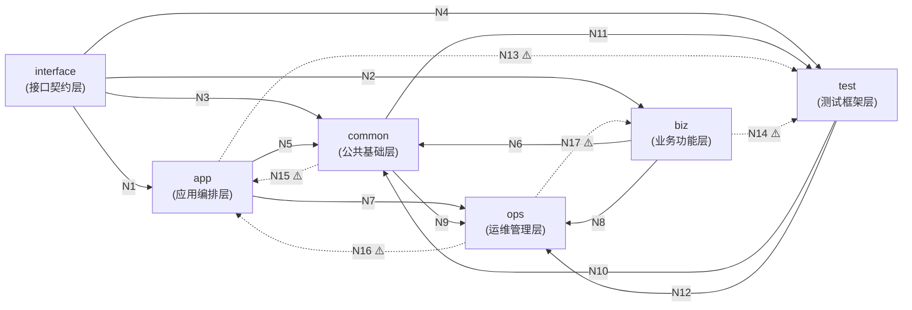

# CodeGraph Multi-Code-Analysis 多仓库依赖关系分析

使用 codegraph 工具和 SQL 直接查询 `codegraph.db`，分析仓库间文件的依赖关系，提供跨仓库变更影响分析。

- **IMPORTANT**: 此 skill 必须完整执行，单仓和多仓都要执行。所有步骤都要完整执行！
- **单仓场景**：项目根目录只有 1 个甚至没有 `.git` 文件夹
- **多仓场景**：项目根目录下有多个 `.git` 子目录
- **依赖数据来源**：`codegraph.db`（已预先索引好的 SQLite 数据库，包含 nodes + edges 表）

---
---

## 仓库范围（Repo Scope）

分析范围由项目根目录的 `codegraph.json` 决定，与 `/core-init` 共用同一份配置：

- **SQL / codegraph.db 路径**：`codegraph index` 本身遵守 `exclude`/`include`，
  被排除的仓库根本不会进入 `codegraph.db`，所有 SQL 查询自动限定在范围内，
  **无需额外传参**。改了配置记得重新索引：`codegraph index`
- **文件系统路径**（`tree-all` / legacy `scan-deps`）：由 `scripts/repo_scope.py`
  读取同一份 `codegraph.json` 过滤

**【强制约束】**
- 仓库数超过 `corespec.maxRepos`（默认 5）时，命令以**退出码 3** 结束。
  这不是失败：应提示用户先跑 `/core-init` 确认范围，**禁止 Agent 自行加 `--force` 重试**
- 待分析仓库列表以 `docs/language.json` 为准，不得自行全盘扫描目录
- 根目录判定见 `scripts/path.py`：优先 `docs/language.json` 等强标记，
  永不越界到 `$HOME`。判错时用 `CORESPEC_PROJECT_ROOT` 强制指定

### ⚠️ 嵌套仓库的命名差异

SQL 用 `file_path` 的**顶层目录**代表仓库：

    SUBSTR(n.file_path, 1, INSTR(n.file_path, '/') - 1) AS repo

因此二级仓库（如 `group/sub_a`）在 SQL 结果里会显示成 `group`，
而 `docs/language.json` 里的键是 `group/sub_a`。生成 `relationship.md` 时
需按 language.json 的键做一次映射，否则同一 `group` 下的多个子仓会被合并统计。
## 逻辑视图生成

### 步骤

#### 1. 获取项目文件树

```bash
codegraph_files 命令（工具名：codegraph_codegraph_files）
```

- 列出所有已索引文件的目录树结构
- `format` 可选：`tree`（默认）、`flat`、`grouped`（按语言分组）
- 用 `pattern` 参数过滤特定文件类型：如 `"*.ts"`, `"*.py"`, `"*.{c,cpp,h}"`
- 用 `path` 参数聚焦子目录

示例用法：
```
codegraph_files(format="tree", pattern="*")
codegraph_files(format="grouped")
codegraph_files(path="src/", format="flat")
```

#### 2. 跨仓库依赖矩阵（SQL 查询 codegraph.db）

连接 `edges` 和 `nodes` 表，按 `file_path` 的顶层目录（代表仓库）分组统计跨仓库依赖边。

```sql
-- 跨仓库边统计（按顶层目录分组）
SELECT
    SUBSTR(n1.file_path, 1, INSTR(n1.file_path, '/') - 1) AS src_repo,
    SUBSTR(n2.file_path, 1, INSTR(n2.file_path, '/') - 1) AS tgt_repo,
    e.kind,
    COUNT(*) AS cnt
FROM edges e
JOIN nodes n1 ON e.source = n1.id
JOIN nodes n2 ON e.target = n2.id
WHERE n1.file_path IS NOT NULL AND n2.file_path IS NOT NULL
  AND n1.file_path != '' AND n2.file_path != ''
  AND SUBSTR(n1.file_path, 1, INSTR(n1.file_path, '/') - 1) != SUBSTR(n2.file_path, 1, INSTR(n2.file_path, '/') - 1)
GROUP BY src_repo, tgt_repo, e.kind
ORDER BY cnt DESC
```

**注意**：跨仓库边指 source 和 target 不属于同一个顶层目录的边。如果项目是单仓（所有文件在同一顶层目录下），此 SQL 返回空，直接跳过依赖矩阵，生成简化的 `relationship.md`。

```sql
-- 单仓内文件依赖统计（按第二层目录分组）
SELECT
    CASE
        WHEN INSTR(SUBSTR(n1.file_path, INSTR(n1.file_path, '/') + 1), '/') > 0
        THEN SUBSTR(n1.file_path, 1, INSTR(SUBSTR(n1.file_path, INSTR(n1.file_path, '/') + 1), '/') + INSTR(n1.file_path, '/') - 1)
        ELSE SUBSTR(n1.file_path, 1, INSTR(n1.file_path, '/') - 1)
    END AS src_dir,
    CASE
        WHEN INSTR(SUBSTR(n2.file_path, INSTR(n2.file_path, '/') + 1), '/') > 0
        THEN SUBSTR(n2.file_path, 1, INSTR(SUBSTR(n2.file_path, INSTR(n2.file_path, '/') + 1), '/') + INSTR(n2.file_path, '/') - 1)
        ELSE SUBSTR(n2.file_path, 1, INSTR(n2.file_path, '/') - 1)
    END AS tgt_dir,
    COUNT(*) AS cnt
FROM edges e
JOIN nodes n1 ON e.source = n1.id
JOIN nodes n2 ON e.target = n2.id
WHERE n1.file_path IS NOT NULL AND n2.file_path IS NOT NULL
  AND n1.file_path != '' AND n2.file_path != ''
  AND SUBSTR(n1.file_path, 1, INSTR(n1.file_path, '/') - 1) = SUBSTR(n2.file_path, 1, INSTR(n2.file_path, '/') - 1)
GROUP BY src_dir, tgt_dir
ORDER BY cnt DESC
```

```sql
-- 仓库统计（文件数、节点数、边数）
SELECT
    SUBSTR(n.file_path, 1, INSTR(n.file_path, '/') - 1) AS repo,
    COUNT(DISTINCT n.id) AS node_count,
    COUNT(DISTINCT n.file_path) AS file_count
FROM nodes n
WHERE n.file_path IS NOT NULL AND n.file_path != ''
GROUP BY repo
ORDER BY repo
```

```sql
-- 歧义依赖：同名文件存在于多个仓库
SELECT
    SUBSTR(n.file_path, INSTR(n.file_path, '/') + 1) AS relative_path,
    COUNT(DISTINCT SUBSTR(n.file_path, 1, INSTR(n.file_path, '/') - 1)) AS repo_count,
    GROUP_CONCAT(DISTINCT SUBSTR(n.file_path, 1, INSTR(n.file_path, '/') - 1)) AS repos
FROM nodes n
WHERE n.file_path IS NOT NULL AND n.file_path != '' AND n.kind = 'file'
GROUP BY relative_path
HAVING repo_count > 1
ORDER BY repo_count DESC
```

#### 3. 读取文件（按优先级）

- **必须读**：每个仓库的构建配置文件（`package.json`, `CMakeLists.txt`, `Cargo.toml`, `go.mod`, `pom.xml` 等），用 `codegraph_search` 或 `codegraph_explore` 定位
- **优先读**：`README.md`（如果存在）
- **其次读**：SQL 查询输出的依赖矩阵结果
- **按需读**：关键仓库的目录树（通过 `codegraph_files`）

#### 4. 输出逻辑视图（保存到 `docs/relationship.md`）

- Mermaid 依赖图
- 仓库角色定位
- 仓库功能系统总结
- 查询文件依赖和影响分析的命令
- **必须执行**：`docs/relationship.md` 文件写入工作目录
- **单仓**：生成简化的 relationship.md，描述单个仓库的结构
- **多仓**：生成完整的依赖关系图

#### 5. 清理（无需额外操作，没有临时文件需要清理）

### 要求

1. **编译文件必须读**：每个仓库都要读
2. **目录树用于理解结构**：`codegraph_files` 展示的是目录组织方式
3. **优先级原则**：先读 README/编译文件理解业务，再读目录树确认结构，最后读 SQL 结果理解依赖
4. **输出文件**：逻辑视图必须保存到 `docs/relationship.md`
5. **高频依赖边必须出现**
6. **异常标注**：低频反向依赖或循环依赖，标注 `⚠️ 待验证`
7. **歧义依赖**：汇总所有歧义分布

### 示例：Mermaid 依赖图（与 4.0 相同）



---

## 快速命令

```
# 获取文件树
codegraph_files(format="tree", pattern="*")

# 查询符号定义
codegraph_explore(query="<符号名>")

# 搜索代码
codegraph_search(query="<搜索词>")

# 影响分析（修改某文件会影响哪些文件——反向追溯）
codegraph_impact(symbol="<文件名>", depth=2)

# 溯源分析（某文件依赖了哪些文件——正向追踪）
codegraph_callees(symbol="<函数/符号名>")

# 查找调用者
codegraph_callers(symbol="<函数/符号名>")
```

---

## 查询详解

### 获取文件树

使用 `codegraph_files` 命令列出所有索引文件的目录结构。

```
codegraph_files(format="tree")        # 树形结构（默认）
codegraph_files(format="flat")        # 简单列表
codegraph_files(format="grouped")     # 按语言分组
codegraph_files(path="src/")          # 限定子目录
codegraph_files(pattern="*.ts")       # 限定文件类型
```

### 查询符号信息

使用 `codegraph_explore` 获取某个符号的完整定义和上下文。

```
codegraph_explore(query="<符号名或文件名>")
```

### 搜索代码

使用 `codegraph_search` 搜索符号名称。

```
codegraph_search(query="<关键词>")
codegraph_search(query="<关键词>", kind="function")
codegraph_search(query="<关键词>", kind="class")
```

### impact - 影响分析（反向追溯）

分析修改某文件会影响哪些文件（哪些文件依赖了它）。

```
codegraph_impact(symbol="<文件名>", depth=2)
```

### trace - 溯源分析（正向追踪）

分析某文件/符号被哪些其他符号调用。

```
codegraph_callees(symbol="<符号名>")     # 该符号调用了谁
codegraph_callers(symbol="<符号名>")     # 谁调用了该符号
```

### dep-report - 依赖关系报告（SQL）

通过直接查询 `codegraph.db` 生成跨仓库依赖矩阵。核心 SQL 模式如上文所示。

---

## SQL 执行方式

当环境中没有 `sqlite3` CLI 工具时，使用 `scripts/sql_query.py`（基于 Python 内置 sqlite3 模块，无需额外安装）：

```bash
# 执行任意 SQL
python scripts/sql_query.py <db_path> --sql "SELECT ..."

# 执行 SQL 文件
python scripts/sql_query.py <db_path> --sql-file queries.sql

# 使用预设查询（覆盖 SKILL.md 中的常用 SQL）
python scripts/sql_query.py <db_path> --preset cross-repo
python scripts/sql_query.py <db_path> --preset single-repo
python sql_query.py <db_path> --preset repo-stats
python sql_query.py <db_path> --preset ambiguous
python sql_query.py <db_path> --preset file-deps --file "repo/path/to/file"
python sql_query.py <db_path> --preset reverse-deps --file "repo/path/to/file"
python sql_query.py <db_path> --preset cross-repo-chain --repo-src A --repo-tgt B
python sql_query.py <db_path> --preset fuzzy-search --keyword "xxx"
python sql_query.py <db_path> --preset unresolved --repo "repo_name"
python sql_query.py <db_path> --preset unresolved-top

# 查看所有预设
python sql_query.py --list-presets

# JSON 输出
python sql_query.py <db_path> --preset repo-stats --json
```

`db_path` 可以是 `codegraph.db` 文件路径，也可以是其父目录（会自动搜索 `codegraph.db` 和 `.codegraph/codegraph.db`）。

---

## SQL 查询模板库

### 文件级统计

```sql
-- 按语言统计文件数
SELECT language, COUNT(*) AS cnt FROM files GROUP BY language ORDER BY cnt DESC;

-- 按节点类型统计
SELECT kind, COUNT(*) AS cnt FROM nodes GROUP BY kind ORDER BY cnt DESC;

-- 按边类型统计
SELECT kind, COUNT(*) AS cnt FROM edges GROUP BY kind ORDER BY cnt DESC;
```

### 文件依赖查询

```sql
-- 查询某文件直接依赖的文件
SELECT DISTINCT n2.file_path
FROM edges e
JOIN nodes n1 ON e.source = n1.id
JOIN nodes n2 ON e.target = n2.id
WHERE n1.file_path = '仓库名/相对路径'
ORDER BY n2.file_path;

-- 查询依赖某文件的所有文件
SELECT DISTINCT n1.file_path
FROM edges e
JOIN nodes n1 ON e.source = n1.id
JOIN nodes n2 ON e.target = n2.id
WHERE n2.file_path = '仓库名/相对路径'
ORDER BY n1.file_path;
```

### 跨仓库调用链查询

```sql
-- 跨仓库调用链（A仓库调用B仓库的具体函数/方法）
SELECT
    n1.file_path AS src_file,
    n1.name AS src_symbol,
    n1.kind AS src_kind,
    n2.file_path AS tgt_file,
    n2.name AS tgt_symbol,
    n2.kind AS tgt_kind,
    e.kind AS edge_kind,
    e.line,
    e.col
FROM edges e
JOIN nodes n1 ON e.source = n1.id
JOIN nodes n2 ON e.target = n2.id
WHERE SUBSTR(n1.file_path, 1, INSTR(n1.file_path, '/') - 1) = '仓库A'
  AND SUBSTR(n2.file_path, 1, INSTR(n2.file_path, '/') - 1) = '仓库B'
ORDER BY n1.file_path, n2.file_path;
```

### 模糊搜索

```sql
-- 通过名称模糊搜索符号
SELECT id, name, kind, file_path, start_line
FROM nodes
WHERE name LIKE '%关键词%'
ORDER BY kind, name
LIMIT 20;

-- FTS5 全文搜索
SELECT id, name, kind, file_path, start_line
FROM nodes_fts
WHERE nodes_fts MATCH '关键词'
LIMIT 20;
```

### 未解析引用（歧义依赖）

```sql
-- 检查未解析的引用（等同于原系统的歧义依赖）
SELECT * FROM unresolved_refs
WHERE file_path LIKE '仓库名/%'
LIMIT 20;

-- 统计未解析引用最多的文件
SELECT file_path, COUNT(*) AS cnt
FROM unresolved_refs
GROUP BY file_path
ORDER BY cnt DESC
LIMIT 10;
```

---

## 数据结构

### codegraph.db 关键表

```
nodes:    id, kind, name, qualified_name, file_path, start_line, end_line, ...
edges:    id, source, target, kind, metadata, line, col
files:    path, content_hash, language, size, modified_at, node_count
unresolved_refs:  from_node_id, reference_name, reference_kind, candidates, ...
nodes_fts:        FTS5 全文搜索虚拟表
```

**说明**：
- `nodes.file_path` = 相对于项目根目录的文件路径，格式如 `仓库名/子目录/文件名`（与原系统的 `repo/path` 格式一致）
- `edges` 的 `kind` 支持：`calls`, `extends`, `contains`, `imports`, `implements`, `references` 等
- `unresolved_refs.candidates` 是 JSON 数组，包含同名文件的候选列表（歧义依赖信息）

### 路径格式

所有文件路径使用 `仓库名/文件路径` 格式：
```
src/agents/oracle.ts
 ↑顶层目录（仓库名）    ↑在仓库中的路径
```

---

## 语言支持

codegraph 自动索引所有支持的语言文件。无需额外配置。
